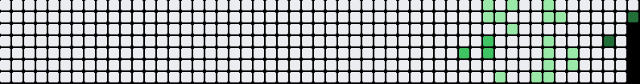

  

  

  

<table align="center">
  <tr>
    <td width="60%" valign="top">

### 🌙 As várias faces de mim?

Sou desenvolvedor Backend com foco em **Java e Spring Boot**, sempre buscando transformar ideias em projetos que me desafiem a aprender algo novo.

Gosto especialmente de desenvolver **APIs**, trabalhar com **bancos de dados** e entender o que acontece além do código — arquitetura, segurança, comunicação entre serviços e as decisões por trás de uma aplicação bem construída.

Atualmente, venho aprofundando meus conhecimentos no ecossistema **Spring**, além de explorar **microsserviços, Kafka e arquitetura de software**.

Também tenho experiência com **JavaScript e TypeScript**, tecnologias que fizeram parte importante da minha trajetória e continuam presentes em alguns dos meus projetos.

  </td>

  <td width="40%" align="center">

  </td>
  </tr>
</table>

  

### Backend
 
 
 
 

### Frontend
 
 
 
 

### Database
 

### Tools
 
 

### Currently Learning
 

  

<table align="center">
  <tr>
    <td width="50%" valign="top" align="center">

### Pokédex

Pokédex interativa com busca, filtros, favoritos e informações dos Pokémon.

**Stack:** JavaScript • HTML • CSS

<a href="https://github.com/DuduDoBalacobaco/pokedex">
  🔗 Ver Projeto
</a>

  </td>

  <td align="center">
    
  </td>

  </tr>

  <tr>
    <td width="50%" valign="top" align="center">
  ### Crud de clientes

  Um crud bem completo e bem arquiteturado.

  **Stack:** Node.js • Express • TypeScript

  <a href="https://github.com/DuduDoBalacobaco/Crud_de_clientes_com_node-express-typescript">
    🔗 Ver Projeto
  </a>

  </td>

  <td align="center">
    
  </td>

  </tr>

</table>

  

  

